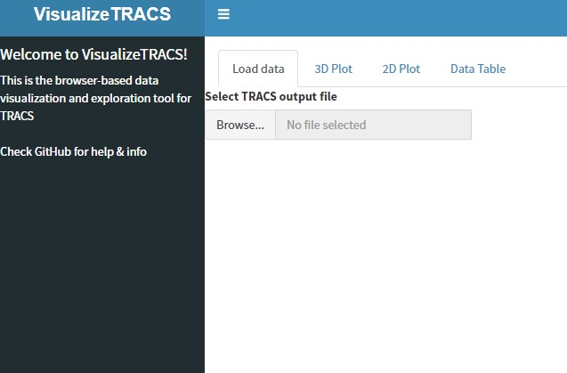
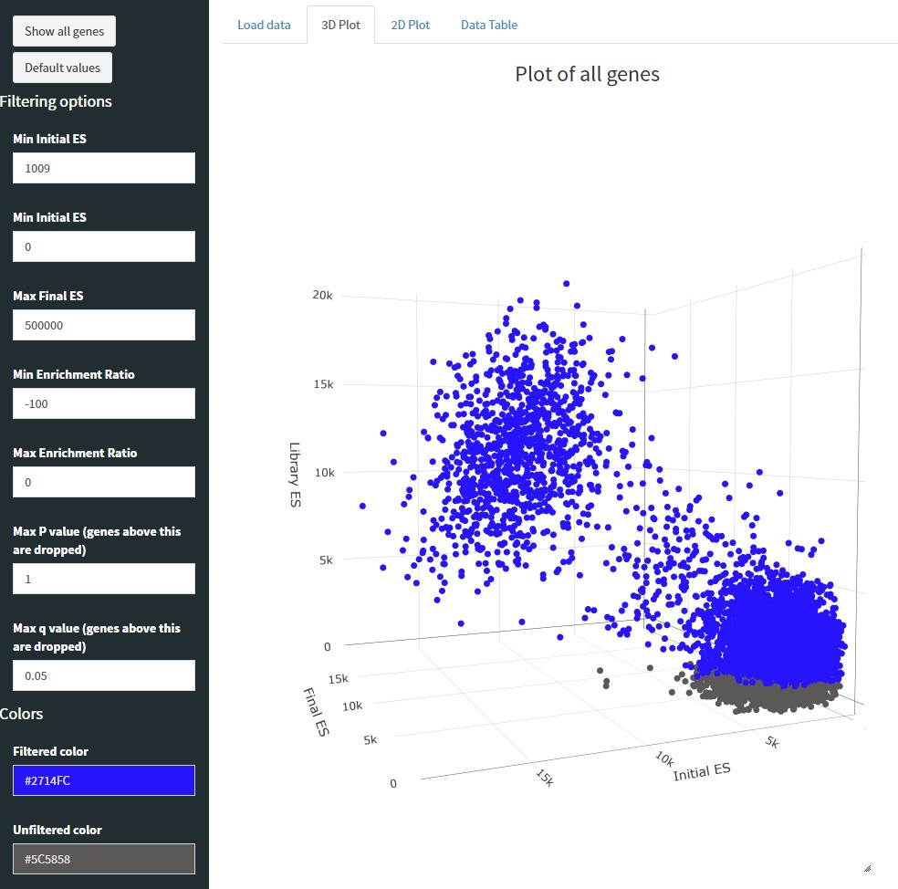
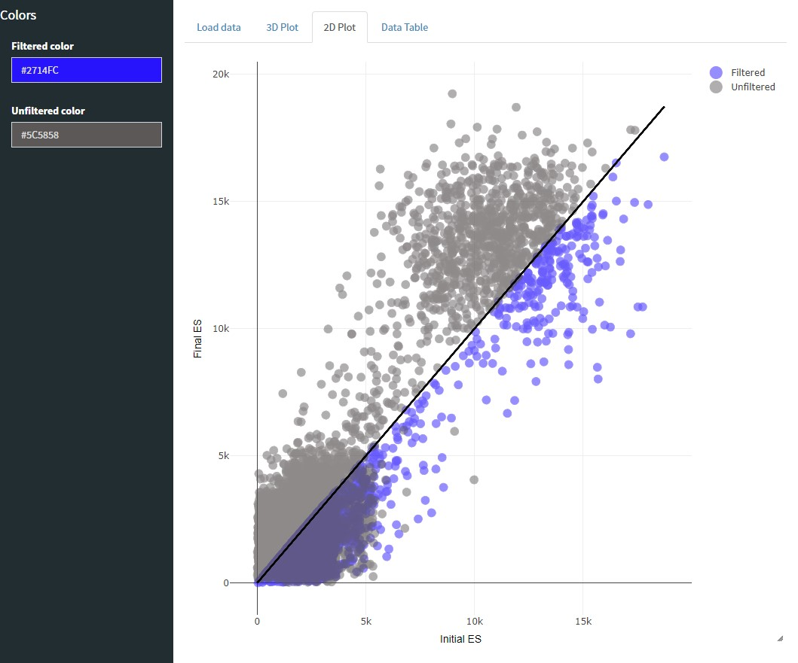
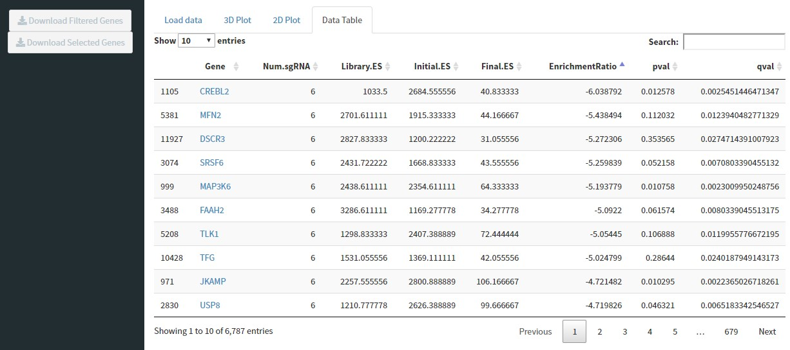

# VisualizeTRACS

# Introduction
VisualizeTRACS is an R-based tool that allows you to visualize data from [TRACS](https://github.com/developerpiru/TRACS)

***The latest release can be downloaded [here](https://github.com/developerpiru/VisualizeTRACS/releases/)***

# Table of Contents

[Installation & Requirements](https://github.com/developerpiru/VisualizeTRACS#installation--requirements)

[Run VisualizeTRACS](https://github.com/developerpiru/VisualizeTRACS#run-visualizetracs)

[Usage](https://github.com/developerpiru/VisualizeTRACS#usage)

## Installation & Requirements

The **minimum requirements** for running VisualizeTRACS are:
- [R 3.5+](https://cran.r-project.org/)	
- shiny
- shinydashboard

To install the **minimum** required packages, enter these commands in R:

```
install.packages("shiny")
install.packages("shinydashboard")
```

Then follow the steps below to [Run VisualizeTRACS](https://github.com/developerpiru/VisualizeTRACS#run-visualizetracs). 

All other required components should be installed upon first launch. **If you run into an error**, you can manually install these other components:

```
install.packages("shiny")
install.packages("shinydashboard")
install.packages("scatterD3")
install.packages("plotly")
install.packages("DT")
install.packages("shinyjqui")
install.packages("colourpicker")
```

## Run VisualizeTRACS

There are two ways to run VisualizeTRACS

1. Automatically download and run the latest version directly from GitHub:

    1. Open a new R session and enter these commands:
	```
	library(shiny)
	library(shinydashboard)
	runGitHub("VisualizeTRACS", "developerpiru")
	```

2. Download a local copy and launch your local copy
    1. Download the latest release from [here](https://github.com/developerpiru/VisualizeTRACS/releases/latest) or by using the download button above
    2. Extract the zip archive
    3. Open a new R session and enter these commands:
	```
	library(shiny)
	library(shinydashboard)
	runApp("/path/to/folder/VisualizeTRACS-version")
	```
	Where ```/path/to/folder/``` is the directory where you extracted the zip archive and ```version``` is the version number you 	downloaded, *e.g.* ``3.0.0``.

If you are using R, a browser window should open automatically showing the app. If you are using RStudio, click "Open in browser" at the top of the popup window.

# Usage

VisualizeTRACS requires you to load a [TRACS](https://github.com/developerpiru/TRACS) output file (in csv format).



You can then view a 3D plot of all scores (Library ES on the z axis, Final ES on the x axis, and Initial ES on the y axis). You can customize the colors for the filtered and unfiltered genes. By default, the first quartile (bottom 25%) of Library ES is set as the minimum threshold for Library ES (genes below this cutoff will be dropped).



Next you can view a plot of the Initial ES vs. Final ES based on the genes you have filtered for using the sidebar in the 3D Plot tab. The diagonal line runs along y=x; any genes below this line have a negative Enrichment Ratio (ER) and any genes above it have a positive ER.



You can view a table of the genes you have filtered in the Data Table tab. You can sort the data by any column. Click on the gene names to the [Gene Cards](https://www.genecards.org/) listing for that gene. Use the download buttons to download the filtered table. You can also click on rows to select individual genes and use the "Download Selected Genes" button to only download a table of those genes.


